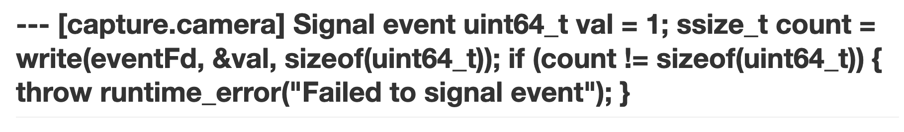

# Changes

The version of *Literate* in this repository is a complete overhaul of Yedidia's original work, one that is connected only by name and inspiration. This document describes what changes have been made and why.

## Migrate to C++

The largest change to the codebase comes from the migration from the D programming language to C++. It's not that I think C++ is superior to D--the converse is likely true. However, two factors drove the decision for a complete rewrite: I'm familiar with C++ (it's my favorite language) and the answer to any possible programming question in C++ can be easily found online. The lack of others programming in D make getting help online spotty at best.

## Work in Markdown

The largest change from a literate development perspective is the elimination of the weaving step made possible by the use of Markdown. A separate step was necessary in Knuth's time to obtain a visually appealing rendering of the program. However, the combination of Markdown and a WYSIWYG editor that supports extended features like image embedding allow the literate sources to render nicely as they are being developed.

Basically, I want to spend my time directly with the Markdown files but I also want them to look good and display embedded images. The next three sections describe syntax changes that make this possible. Multiple tools exist to convert Markdown to HTML when that format is desired.

## Code blocks

The primary reason that files written for *Literate* render poorly when interpreted directly as Markdown is the choice of `---` to delineate code blocks. Consider the following example:

```
--- [capture.camera] Signal event
uint64_t val = 1;
ssize_t count = write(eventFd, &val, sizeof(uint64_t));
if (count != sizeof(uint64_t))
{
  throw runtime_error("Failed to signal event");
}
---
```

This produces ugly output when rendered as Markdown:



The solution to this problem is to modify *Literate* to use `` ``` `` as code block delimiters and to introduce the `@code` statement. The example above now becomes:

````
@code [capture.camera] Signal event
```
uint64_t val = 1;
ssize_t count = write(eventFd, &val, sizeof(uint64_t));
if (count != sizeof(uint64_t))
{
  throw runtime_error("Failed to signal event");
}
```
````

Which renders more naturally as Markdown:

@code [capture.camera] Signal event
```
uint64_t val = 1;
ssize_t count = write(eventFd, &val, sizeof(uint64_t));
if (count != sizeof(uint64_t))
{
  throw runtime_error("Failed to signal event");
}
```

The new `@code` statement specifies the block name and needs to occur on the line immediately preceding the opening delimiter. Any code blocks that don't have this statement will appear as code in the markdown file but will not be included in the tangled output.

Another advantage of this approach is the ability to specify the language of a code block:

````
@code [capture.camera] Signal event
```cpp
uint64_t val = 1;
ssize_t count = write(eventFd, &val, sizeof(uint64_t));
if (count != sizeof(uint64_t))
{
  throw runtime_error("Failed to signal event");
}
```
````


Markdown editors can then properly colorized the code:

@code [capture.camera] Signal event
```cpp
uint64_t val = 1;
ssize_t count = write(eventFd, &val, sizeof(uint64_t));
if (count != sizeof(uint64_t))
{
  throw runtime_error("Failed to signal event");
}
```

Similar to the old `---` delimiter, the `@code` statement may end with the `+=` modifier to extend a previously defined block.

## File blocks

One of the improvements introduced in Yedidia's *Literate* was the ability to save any code block as a file. For example, the following would be saved to `output.sh`:

```
--- scripts/output.sh
#!/bin/sh
echo "Test"
---
```

The primary feature I found missing from this approach was the ability to automatically set the execute bit on literate scripts. A secondary concern was that the decision of whether a code block was a file or not occurred in a somewhat opaque fashion that could lead to unexpected or undesired behavior. The solution is to introduce a new `@file` statement which takes the file name and optionally ends with `+x` modifier that instructs the preprocessor to set the execute bit:

````
@file scripts/output.sh +x
```
#!/bin/sh
echo "Test"
```
````

Any directories that do not exist will be created, e.g. the `scripts` directory from the example above will be created if necessary.

## Discard directives

The original *title* and *section* directives (`@title` and `@s`) have been dropped because neither renders nicely as Markdown; rather, Markdown's built-in header syntax already fills this purpose nicely (e.g. `#`, `##`). And these directives don't play any functional role now that we no longer have the concept of weaving a literate source file.

Yedidia's *book* directive (`@book`) was used to indicate that all hyperlinks in a literate file should be processed as additional literate files, allowing a single index file to be tangled into a entire source tree. This was a big step forward in modernizing literate programs but had several drawbacks: it required maintaining a master list of source files and this list could not contain links to images or web pages or tangling would fail.

This version of *Literate* instead treats every literate source file as a book, walking the web of linked Markdown files and processing each only once. It ignores any links that do not have the `.md` extension, skips any that are not local (e.g. http), and warns of any file links that are missing rather than failing.

## Change detection

Output files will only be saved to disk if they don't exist or have changed. This seems like a minor change but can save quite a bit of time because most build systems detect changes by the source file's modification timestamp.

## Return error code

*Literate* will return a non-zero exit code if errors are encountered during tangling. Again, this is a minor change but is useful because it allows scripts to detect the error and halt.
