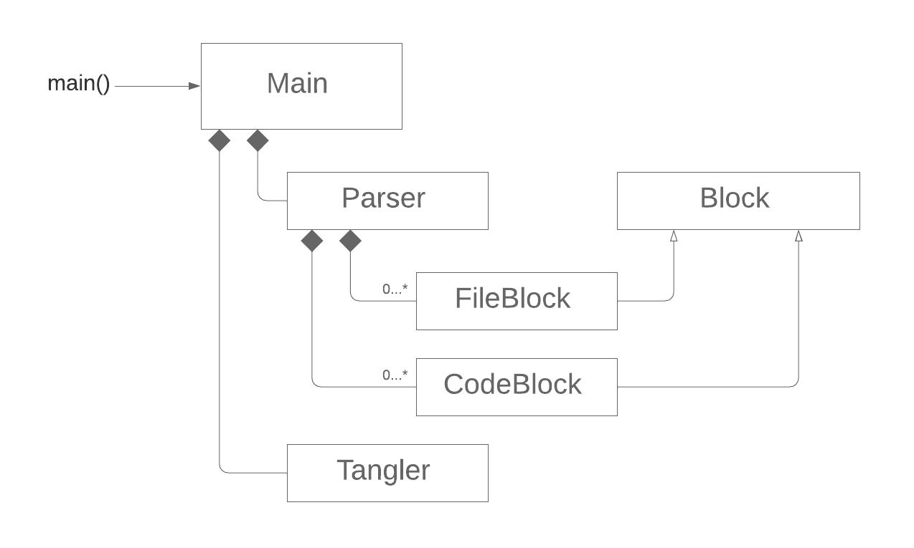

# Literate

[Literate programming](https://en.wikipedia.org/wiki/Literate_programming) is a paradigm where the primary focus is to convey an understanding of the system to human readers rather than merely convince the computer to behave in a particular way. A literate program consists of an explanation of the code in a natural language such as English which is interspersed with the snippets of code to be executed. It captures not just what the software is doing, which one can read from the code itself, but *why* the author choose to do it that way.

## Advantages

Literate programming produces a far superior result than any other development approach that I've ever tried. Its main benefits are:

1. **Clarity of thought.** By far the biggest boon is clarity in the design and implementation of the software. The literate approach forces you to think through and articulate what you are doing, constantly explaining the design and unfolding program code to an imaginary reader. Flaws in the design are identified and corrected earlier and explaining an ugly hack is more work and much less satisfying than coming up with an elegant solution. The literate paradigm produces a transformation in the state of mind of the programmer like no other that I've encountered.
2. **Actually useful documentation.** The tight coupling of *what* and *why* in a literate program results in documentation that is actually useful and in sync with the source code. This is far superior to the other two options that are normally observed in the wild: either no documentation at all (the most common) or documentation that is out of date and doesn't describes the current version of the software. It requires tremendous discipline to keep separate documentation and code in sync but literate programming makes it easy.
3. **Structural freedom.** Literate programs can be written in whatever order is best for conveying an understanding of what they do and why the developers choose to do it that way, freeing programmers from the structure imposed by the compiler.
4. **Knowledge transfer.** New developers can bring themselves up to speed on a literate code base without being a distraction to the existing team. This is far more efficient than other paradigms where the only options are to have the existing team walk new members through the code and/or have the new members laboriously reverse-engineered the code.

There are several misconceptions around literate programming. First, some are under the impression that literate programs need to be really wordy. In truth, the developer is free to write as much or as little as necessary to capture their thought process. Others are of the opinion that it is unnecessary because code should be entirely self-documenting. However, not only does that approach not capture the high-level design of the system, but people tend to forget that comments aren't about what is the code doing, which is obvious from reading it, but why the developer choose to do it that way.

## History

Donald Knuth developed literate programming back in late 70s and early 80s. A software application in his original system was written as a single *web* file and consisted of a mixture of English, TEX, and Pascal. This *web* file was processed by two applications, *tangle* and *weave*. The *tangle* application extracted the Pascal portions and combined them into a source file that could be compiled to obtain the executable, while *weave* processed the entire *web* file into a typeset file that could be rendered in a visually appealing format. The figure below is from Knuth's original paper and depicts this workflow:

<p align=center>
  
</p>

This repository started as a fork of Zachary Yedidia's [*Literate*](https://github.com/zyedidia/Literate) application in which he extended and modernized Knuth's ideas through a number of new features such as writing the *web* files in [Markdown](https://daringfireball.net/projects/markdown/), adding support for languages other than Pascal, and supporting multiple input and output files. My version is a complete overhaul of Yedidia's original work to fit my development workflow. See the [changes](Changes.md) document for details on what was changed and why.

## Building

**TODO**

[Build](Build.md)

Building on Mac:

```sh
$ cd ./tangled
$ ./Build.sh
$ cp ../build/lit /usr/local/bin
```

Building on Windows using Git Bash:

```sh
$ cd ./tangled
$ ./Build.sh
[Open solution in Visual Studio and go from there]
$ mkdir /c/Tools
$ cp ../build/Release/lit.exe /c/Users/shane/bin
```

Development:

Run the following any time you make changes to the Markdown files, prior to rebuilding. The command should be run from the root of the repository.

```sh
$ lit -o ./tangled README.md
```

## Application

So what might a literate program actually look like in practice? Well, you're looking at one. This codebase, like Knuth's and Yedidia's, is written in the literate style. The current file contains the high-level documentation with links that allow the reader to drill down into the actual implementation files. The figure below shows the classes the application is composed of and their relationship to one another:

<p align=center>
  
</p>

The list below gives a brief description of each class with links to the implementation files:

- [Main](Main.md): The main application class that parses the command line arguments and uses the *Parser* and *Tangler* classes to process the web of literate files.
- [Block](Block.md): Abstract base class that encapsulates variables and functions common to the *FileBlock* and *CodeBlock* classes.
- [FileBlock](FileBlock.md): Encapsulates a single literate file block.
- [CodeBlock](CodeBlock.md): Encapsulates a single literate code block.
- [Parser](Parser.md): Contains logic for parsing the web of literate source files.
- [Tangler](Tangler.md): Tangles the file and code blocks into the output files.

## Limitations


Immature development tools.
Learning curve.
No "right" way.
Most programmers aren't writers.

- Keep track of the directory root for each file that is being parsed and locate all child files based on that root.
- Remember the file and line where (1) each code block is defined and (2) each file is linked from.
- Update error handling to be more descriptive.

