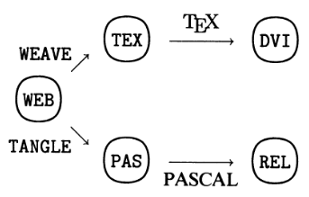

# Literate

This repository is a fork of [*Literate*](https://github.com/zyedidia/Literate), and excellent tool that was inspired by Donald Knuth's [literate programming](https://en.wikipedia.org/wiki/Literate_programming) paradigm. [Zachary Yedidia](https://github.com/zyedidia) extended and modernized Knuth's ideas when he created *Literate*. I recommend familiarizing yourself with his system in order to understand why I've created this fork.

## Building on MacOS

Download [*dmd*](https://dlang.org/download.html#dmd), the D compiler, and install the package. Download [*dub*](https://code.dlang.org/download), the D package manager, and extract the archive and copy the executable to `usr/local/bin`. Both should be now available from the command line:

```
$ dmd -h
DMD64 D Compiler v2.085.0
Copyright (C) 1999-2019 by The D Language Foundation, All Rights Reserved written by Walter Bright
...

$ dub -h
USAGE: dub [--version] [<command>] [<options...>] [-- [<application arguments...>]]
...
```

Clone the repository and build:

```
$ git clone git@github.com:sclaggett/Literate.git
$ cd Literate
$ make
```

Copy the executable to the *bin* directory:

```
$ cp bin/lit /usr/local/bin/
```

## Motivation

Knuth developed literate programming back in late 70s and early 80s, a time which seems like eons ago in the world of computing. A software application in his original system was written as a single *web* file and consisted of a mixture of English, TEX, and Pascal. This *web* file was then processed by two applications, *tangle* and *weave*. The former, *tangle*, extracted the Pascal portions and combined them into a source file that could be compiled to obtain the executable. The latter, *weave*, processed the entire *web* file into a typeset file that could be rendered in a visually appealing format. The figure below, from Knuth's original paper, depicts this workflow:



*Literate* introduced a number of features that modernized Knuth's original work, including writing the *web* files in [Markdown](https://daringfireball.net/projects/markdown/), adding support for languages other than Pascal, and supporting multiple input and output files. However, one of the sticking points of Knuth's original system is still an issue for *Literate*: switching to literate programming means introducing additional steps in the development workflow.

This fork of *Literate* was created to deal with the additional step that I consider the largest impedement: the need to *weave* in order to obtain a visually appealing rendering of the program. My goal is to be able to write literate programs in Markdown editors that support extended features like image embedding and preview editing and have everything render nicely as it is being developed. I want to spend most of my time directly with the Markdown files but I also want them to look good and display embedded images.

## Code blocks

The primary reason that files written for *Literate* render poorly when interpreted directly as Markdown is the choice of `---` to delineate code blocks. Consider the following example:

```
--- Babel presets
"presets": [
  "@babel/preset-env",
  "@babel/preset-react"
],
---
```

This produces ugly output when rendered as Markdown:

--- This is a code block
"presets": [
  "@babel/preset-env",
  "@babel/preset-react"
],
---

My solution to this problem is to modify *Literate* to use `` ``` `` as code block delimiters and to introduce the `@code` statement. The example above now becomes:

````
@code Babel presets
```
"presets": [
  "@babel/preset-env",
  "@babel/preset-react"
],
```
````

Which renders more naturally as Markdown:

@code Babel presets
```
"presets": [
  "@babel/preset-env",
  "@babel/preset-react"
],
```

The new `@code` statement specifies the block name and needs to occur on the line immediately preceeding the opening delimiter. Any code blocks that don't have this statement will appear as code in the markdown file but will not be included in the tangled output.

One advantage of this approach is the ability to specify the language of a code block:

````
@code Sample JavaScript code
```javascript
const a = 5;
const aa = pow(a, 2);
doSomething(aa);
```
````

Markdown editors can then properly colorized the code:

@code Sample JavaScript code
```javascript
var a = 5;
var aa = Math.pow(a, 2);
doMoreStuff(aa);
```

Similar to the old `---` delimiter, the `@code` statement may end with one of the following code block modifiers:
- `+=`: Adds code to an already defined block
- `:=`: Redefines a codeblock

## File blocks

One of the improvements introduced in *Literate* is the ability to save any code blocks with a name that appeared to be a file as a file with the same name. For example, the following would be saved to `output.sh`:

```
--- output.sh
#!/bin/sh
echo "Test"
---
```

The primary issue I ran into with this approach was the desire to automatically set the execute bit on literate scripts. A secondary concern was that the decision of whether a code block was a file or not occurred in a somewhat opaque fashion that could lead to unexpected or undesired behavior. My solution is to introduce a new `@file` statement which takes the file name and optionally ends with `+x` to set the execute bit:

````
@file output.sh +x
```
#!/bin/sh
echo "Test"
```
````

## Directory creation

An issue in the original *Literate* program was its inability to create output directories if they didn't exist. Consider the following example:

````
@file database/mysql.js
```mysql
var mysql = require("mysql");

var pool  = mysql.createPool({
  host: "localhost",
  user: "mysql",
  password: "mysql",
  database: "test"
});
```
````

This example will fail to *tangle* if the `database` directory don't exists. While this is a minor complication, it can become cumbersome in larger projects. This version of *Literate* will automatically create directories if they don't exist. 
